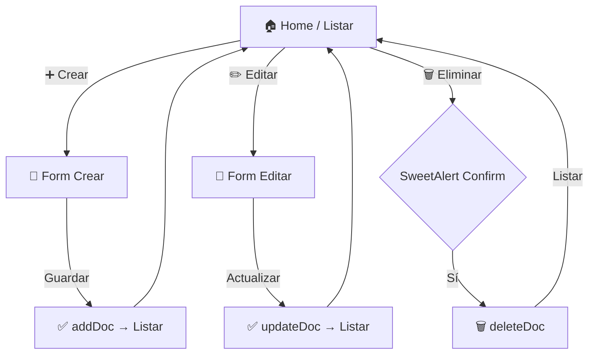

[](https://reactjs.org/)
[](https://firebase.google.com/)
[]
[](https://sweetalert2.github.io/)

# ⚡ Framing Quotation System

**Sistema completo de cotizaciones para enmarcado** - **CRUD FULL** con **React + Firebase Firestore**. 🔍 Listar, ➕ Crear, ✏️ Editar, 🗑️ Eliminar productos (materiales: modelo, colección, proveedor, desperdicio, costo).

✅ **100% funcional** - Desplegado en `localhost:3000`.

## 🎯 Features Implementadas

| Feature           | Estado | Descripción                                            |
| ----------------- | ------ | ------------------------------------------------------ |
| **Listar (Show)** | ✅     | Tabla dark con todos los productos. Refresh real-time. |
| **Crear**         | ✅     | Formulario completo. `addDoc()`.                       |
| **Editar**        | ✅     | Carga por ID `getDoc()`, `updateDoc()`.                |
| **Eliminar**      | ✅     | SweetAlert2 confirm + `deleteDoc()`.                   |
| **Navegación**    | ✅     | React Router: `/` (list), `/create`, `/edit/:id`.      |
| **UI/UX**         | ✅     | Bootstrap 5 + FontAwesome icons + modals.              |

## 📱 Flujo de la App (Mermaid)



## 📁 Estructura del Proyecto

```
framing-quotation-system/
├── public/                 # Assets estáticos
├── src/
│   ├── App.js             # Rutas Router DOM
│   ├── components/
│   │   ├── create.js      # ➕ Form addDoc
│   │   ├── edit.js        # ✏️ Form updateDoc
│   │   └── show.js        # 🔍 Tabla + deleteDoc
│   └── firebaseConfig/
│       └── firebase.js    # 🔥 Config Firestore
├── package.json           # React 19.2 + deps
├── README.md              # 👈 Tú estás aquí
└── TODO.md                # Progreso actual
```

## 🔥 Firebase Config & Schema

**Proyecto**: `framing-quotation-system` (Firestore).

**Collection**: `products`

```js
{
  modelo: string,      // 'Modelo A'
  coleccion: string,   // 'Verano 2024'
  proveedor: string,   // 'ProveedorX'
  desperdicio: number, // 0.15
  costo: number        // 25.50
}
```

**Ejemplo conexión** (todos los components):

```js
import { db } from '../firebaseConfig/firebase';
const productsCollection = collection(db, 'products');
```

## 🚀 Instalación & Demo

<details>
<summary>📦 Scripts ejecutables (click para copiar)</summary>

```bash
# 1. Instalar dependencias
npm install

# 2. Iniciar servidor dev
npm start
```

**Abre**: http://localhost:3000

<button onclick="navigator.clipboard.writeText('npm start'); alert('¡Comando copiado! 🚀');">📋 Copiar npm start</button>

</details>

### Demo Rutas

| Ruta           | Acción    | Screenshot                                                                               |
| -------------- | --------- | ---------------------------------------------------------------------------------------- |
| `/`            | Listar 🔍 |  |
| `/create`      | Crear ➕  |           |
| `/edit/abc123` | Editar ✏️ |          |

## 🛠️ Stack Técnico Completo

| Categoría    | Tech                   | Versión/Badge                                                      |
| ------------ | ---------------------- | ------------------------------------------------------------------ |
| **Frontend** | React                  |          |
| **Router**   | React Router DOM       | v6.30+                                                             |
| **Backend**  | Firebase Firestore     | v12                                                                |
| **UI**       | Bootstrap 5 + FA Icons |       |
| **UX**       | SweetAlert2            |  |

## 📊 Ejemplo de Uso

1. **Listar**: Navega a `/` → Tabla con botones Editar/Eliminar.
2. **Crear**: `/create` → Llena form → Guarda → Redirige a lista.
3. **Eliminar**: Click 🗑️ → Modal confirm → Elimina + refresh.

**Firestore Rules** (recomendado para prod):

```js
rules_version = '2';
service cloud.firestore {
  match /databases/{database}/documents {
    match /products/{document} {
      allow read, write: if true;  // Cambiar a auth
    }
  }
}
```

## 🔮 Próximos Pasos (ver TODO.md)

- Agregar búsqueda/paginación.
- Autenticación Firebase Auth.
- Cálculo cotizaciones automáticas.
- Deploy Firebase Hosting.

## 📞 Soporte

¡App **FULLY OPERATIONAL**! Reporta issues en GitHub.

⭐ **¡Gracias por usar Framing Quotation System!** 🚀
